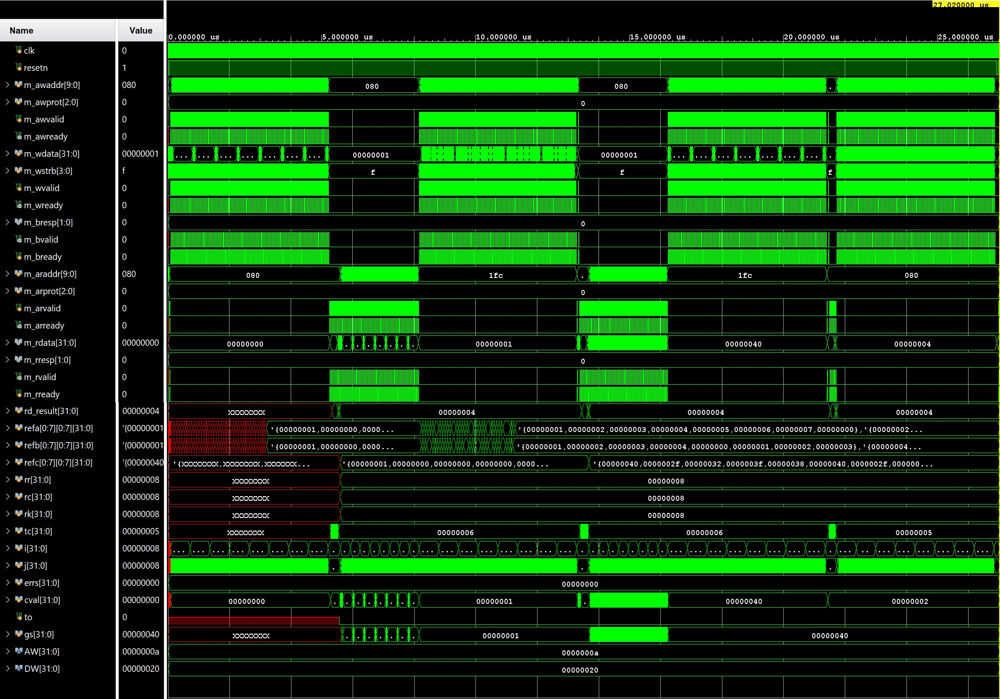
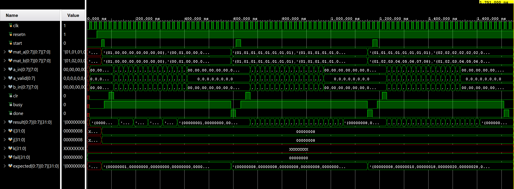
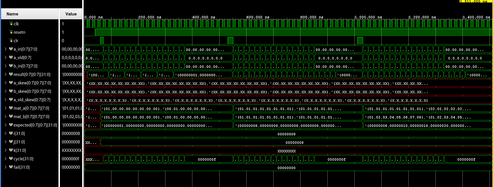
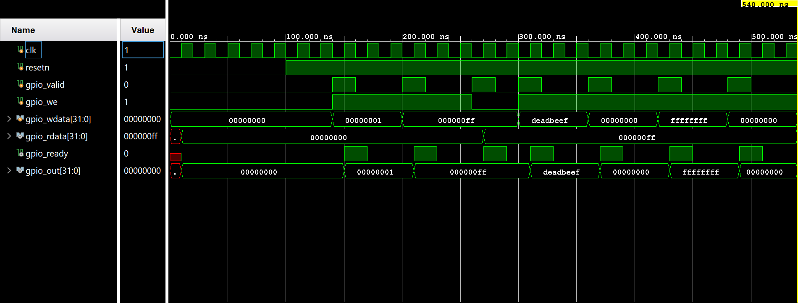
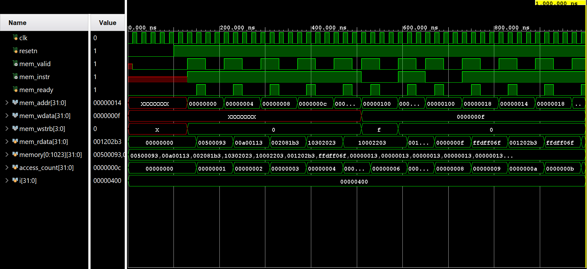

# RISC-V SoC

PicoRV32-based SoC with memory-mapped peripherals, bare-metal C firmware, AXI-Lite interconnect, and 8x8 INT8 systolic array matrix multiply accelerator (VPU). 
Verified in Vivado behavioral simulation.

---

## Architecture

```
top_axi.v
├── picorv32 (submodule)      RV32I CPU core
├── picorv32_axi_adapter      native valid/ready → AXI-Lite master
├── axi_crossbar              1 master → 4 slaves, decode on addr[31:28]
├── bram_axi_slave            Slave 0: 4KB instruction + data memory
├── uart_axi_slave            Slave 1: 115200 baud TX
├── gpio_axi_slave            Slave 2: 32-bit output register
└── vpu_axi_slave             Slave 3: 8x8 INT8 systolic array (VPU)
```

**Memory Map:**

| Address | Peripheral | Access |
|---|---|---|
| `0x0000_0000` | BRAM (4KB) | R/W |
| `0x2000_0000` | UART TX data | W |
| `0x2000_0004` | UART TX status | R |
| `0x3000_0000` | GPIO output | R/W |
| `0x4000_0000` | VPU accelerator (8x8 systolic array) | R/W |

UART status bit 0 = `tx_busy` (1 = transmitting, 0 = ready)

**VPU Register Map (base 0x4000_0000):**

| Offset | Name | Access | Description |
|---|---|---|---|
| `0x000–0x03F` | Matrix A | W | 8x8 INT8, row-major (16 words) |
| `0x040–0x07F` | Matrix B | W | 8x8 INT8, row-major (16 words) |
| `0x080` | CTRL | R/W | bit[0]=start(W,self-clear), bit[1]=busy(R), bit[2]=done(R,sticky) |
| `0x100–0x1FC` | Result | R | 8x8 INT32, row-major (64 words) |

---

## File Structure

```
.
├── firmware
│   ├── start.S          startup: zero regs, set sp=0x1000, call main()
│   ├── link.ld          .text at 0x0, stack top at 0x1000 (4KB BRAM)
│   ├── main.c           uart_print() + gpio_write() + vpu_matmul()
│   └── Makefile         ELF → BIN → byte-swapped HEX for $readmemh
│
└── rtl
    ├── axi
    │   ├── top_axi.v                       SoC top level
    │   ├── axi_crossbar.v                  1 master → 4 slaves
    │   ├── bram_axi_slave.v                4KB BRAM
    │   ├── gpio_axi_slave.v                32-bit GPIO
    │   ├── uart_axi_slave.v                115200 baud TX
    │   └── vpu_axi_slave.v                 8x8 INT8 systolic array wrapper
    ├── sim
    │   ├── tb_top.v                        full SoC testbench
    │   ├── tb_gpio.v                       GPIO peripheral unit test
    │   ├── tb_picorv32.v                   CPU instruction test
    │   ├── tb_vpu_axi_slave.v              VPU accelerator testbench
    │   ├── tb_macro_fsm.v                  macro FSM controller test
    │   ├── tb_micro_fsm.v                  micro FSM controller test
    │   ├── tb_pe.v                         processing element unit test
    │   ├── tb_systolic_array.v             systolic array testbench
    │   └── wvfrm                           simulation waveform screenshots
    ├── vpu
    │   ├── vpu_axi_slave.v                 AXI-Lite slave wrapper
    │   ├── macro_fsm.v                     macro instruction interpreter
    │   ├── micro_fsm.v                     micro instruction FSM controller
    │   ├── pe.v                            processing element (8-bit INT MAC)
    │   └── systolic_array.v                8x8 systolic array fabric
    └── soc
        ├── top.v                           original SoC (valid/ready bus)
        ├── decoder.v                       combinational address router
        ├── bram.v                          4KB BRAM
        ├── gpio.v                          GPIO peripheral
        ├── uart_tx.v                       UART TX peripheral
        └── cpu                             PicoRV32 (forked from YosysHQ/picorv32)
```

---

## Simulation Waveforms

**VPU AXI-Lite Slave with Systolic Array (`tb_vpu_axi_slave.jpeg`)**



Full matrix multiply testbench: identity, arbitrary, and reset-mid-operation scenarios. Demonstrates AXI register interface, busy/done status transitions, and INT32 result coherency.

**Macro FSM (High-Level Instruction Sequencer) (`tb_macro_fsm.png`)**



Macro instruction interpreter controlling matrix loads and accumulator operations. Interfacing with micro FSM for VLIW microinstruction dispatch.

**Systolic Array Fabric (`tb_systolic_array.png`)**



8x8 INT8 processing element array with pipelined A/B flow, partial product paths, and INT32 accumulator updates.

**Full SoC with VPU (`tb_top - axi.png`)**


**GPIO unit test (`tb_gpio.png`)**



**PicoRV32 instruction test (`tb_picorv32.png`)**



---

## Firmware Build

```bash
sudo apt install gcc-riscv64-unknown-elf xxd
cd firmware/
make        # → firmware.elf, firmware.bin, firmware.hex
make clean
```

Compiler flags: `-march=rv32i -mabi=ilp32 -nostdlib -nostartfiles -ffreestanding -Os`

No libgcc dependency - integer printing uses repeated subtraction to avoid `__udivsi3`/`__umodsi3` on rv32i.

Current binary: **1168 bytes** (28% of 4KB BRAM)

---

## VPU Accelerator

8x8 INT8 systolic array matrix multiply unit with AXI-Lite register interface. Elements flow right and down with one-cycle register delay per hop. Accumulator (INT32) is cleared before each matrix operation and latched on completion.

**Register Interface:**
- `0x000–0x03F`: Matrix A (row-major, INT8 packed 4-per-word)
- `0x040–0x07F`: Matrix B (row-major, INT8 packed 4-per-word)
- `0x080`: CTRL – bit[0]=start (self-clearing), bit[1]=busy, bit[2]=done (sticky)
- `0x100–0x1FC`: Result (64 INT32 words)

**Timing:** 26 cycles core execution + AXI overhead per matrix multiply.

**Architecture:**
- `macro_fsm.v`: High-level instruction sequencer
- `micro_fsm.v`: VLIW microinstruction FSM controller
- `systolic_array.v`: 8x8 PE fabric with accumulator tree
- `pe.v`: INT8×INT8→INT32 processing element with pipelined MAC

---

## Simulation

Hardcode firmware path in `bram_axi_slave.v`:
```verilog
$readmemh("C:/path/to/firmware/firmware.hex", memory);
```

Add all files under `rtl/axi/`, `rtl/vpu/`, and `rtl/soc/cpu/picorv32.v` as design sources. Add `rtl/sim/tb_top.v` as simulation source and set as top. Run Behavioral Simulation:

```tcl
run 60000000ns
```

Expected output:
```
[BRAM-AXI] Loaded firmware.hex
[100000 ns] Reset released
[t ns] GPIO WRITE: 0x00000001
[t ns] UART RX: 'P'  (0x50)
...
[t ns] VPU-W: addr=0x40000000 data=matrix_a_word
[t ns] VPU-W: addr=0x40000040 data=matrix_b_word
[t ns] VPU-W: addr=0x40000080 data=0x00000001 (start)
[t ns] VPU-R: addr=0x40000080 result=0x000000xx (busy/done)
[t ns] VPU-R: addr=0x40000100 result=0x00000xxx (accumulated result)
...
  PASS  GPIO  : 0x00000001 seen within 500 us
  PASS  CPU   : no trap
  PASS  VPU   : matrix result valid
```

---

## Implementation Notes

**AXI-Lite bus** - five independent channels: AW, W, B (write path) and AR, R (read path). Crossbar decodes `addr[31:28]` and latches slave selection at AW/AR handshake so the B/R response mux stays stable for the full transaction.

**Adapter** - `picorv32_axi_adapter` is built into `picorv32.v`. Converts PicoRV32 `mem_valid/mem_ready` to AXI-Lite. No separate adapter file needed.

**Slave interface** - AW and W channels buffered independently since they can arrive in any order. Same pattern across all four slaves.

**UART state machine** - TX FSM and MMIO handshake share one `always @(posedge clk)` block. Two separate blocks driving `tx_state` causes a register conflict that locks `bit_idx` at 1 permanently.

**BRAM byte order** - raw `xxd` output is little-endian. `$readmemh` loads each line as a big-endian word. Without `--reverse-bytes=4` the CPU jumps to a garbage address on the first cycle.

**`$readmemh` path** - string parameters do not override reliably in XSim. Hardcode the absolute path directly in the `initial` block of `bram_axi_slave.v`.

**VPU AXI-Lite interface** - 10-bit address bus covers register map `0x000–0x1FC`. Matrix A and B use byte-granular writes (WSTRB) for flexible INT8 element loading. Control register bit[0] (start) is self-clearing; bit[1] (busy) reflects FSM state; bit[2] (done) is sticky until next start write.

**Systolic array pipelining** - A and B data flow through stateful pipeline stages. One-cycle register delays at each PE hop. Accumulator results latch on FSM completion pulse to ensure CPU-accessible coherent state even if a new operation is immediately started.

**Macro vs. Micro FSM** - macro_fsm handles high-level matrix sequences (load, compute, store). micro_fsm decodes one-hot VLIW microinstructions (shift, load_acc, clear, etc.). Macro issues sequence of micro instructions, micro drives datapath signals one cycle per instruction.

---

## Signal Reference

| Signal | Dir | Description |
|---|---|---|
| `mem_valid` | CPU → adapter | request active |
| `mem_instr` | CPU → adapter | 1=fetch, 0=data |
| `mem_addr` | CPU → adapter | byte address |
| `mem_wdata` | CPU → adapter | write data |
| `mem_wstrb` | CPU → adapter | byte enables (0000=read) |
| `mem_ready` | adapter → CPU | transaction complete |
| `mem_rdata` | adapter → CPU | read data |

| Channel | Signals | Direction |
|---|---|---|
| AW | `awaddr`, `awvalid`, `awready` | master → slave |
| W | `wdata`, `wstrb`, `wvalid`, `wready` | master → slave |
| B | `bresp`, `bvalid`, `bready` | slave → master |
| AR | `araddr`, `arvalid`, `arready` | master → slave |
| R | `rdata`, `rresp`, `rvalid`, `rready` | slave → master |

---

## References

- [PicoRV32](https://github.com/YosysHQ/picorv32)
- [RISC-V ISA Specification](https://riscv.org/technical/specifications/)
- [RISC-V GNU Toolchain](https://github.com/riscv-collab/riscv-gnu-toolchain)
- [AMBA AXI Protocol Specification](https://developer.arm.com/documentation/ihi0022)
- [Vitis HLS User Guide UG1399](https://docs.amd.com/r/en-US/ug1399-vitis-hls)